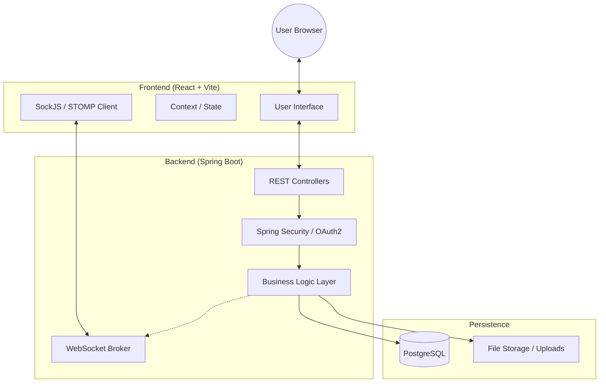
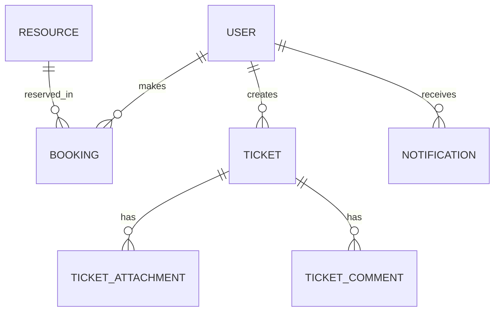

# Smart Campus Operations Hub

[](https://www.oracle.com/java/)
[](https://spring.io/projects/spring-boot)
[](https://reactjs.org/)
[](https://www.postgresql.org/)
[](https://github.com/Ravidujee19/it3030-paf-2026-smart-campus-groupY3S2-WE-152/actions/workflows/ci.yml)

The **Smart Campus Operations Hub** is an integrated management system designed to streamline campus operations, resource allocation, and incident reporting. It provides a centralized platform for students, staff, and administrators to interact with campus services efficiently.

---

## 🏗️ System Architecture

The system follows a modern decoupled architecture with a clear separation of concerns between the frontend, backend, and real-time messaging layers.



### Architectural Key Points:
-   **RESTful API**: Stateless communication between frontend and backend.
-   **WebSocket Layer**: Real-time push notifications for booking status and system alerts.
-   **Security**: Role-Based Access Control (RBAC) enforced via Spring Security and Google OAuth2.
-   **Database**: Relational data modeling with Hibernate/JPA.

---

## 🛠️ Technology Stack

### Backend
-   **Framework**: Spring Boot 3.4.0
-   **Security**: Spring Security + Google OAuth2 Integrated Login
-   **Persistence**: Spring Data JPA / Hibernate
-   **Messaging**: Spring WebSocket (STOMP / SockJS)
-   **Database**: PostgreSQL
-   **Utilities**: Lombok, Jakarta Validation

### Frontend
-   **Framework**: React 19 (Vite)
-   **Routing**: React Router 7
-   **State Management**: React Context API
-   **Styling**: Vanilla CSS / Modular Design
-   **Communication**: Axios
-   **Real-time**: @stomp/stompjs & SockJS

---

## 📦 Core Modules

### 👤 User & Role Management
-   Google OAuth2 Authentication.
-   Dynamic profile management.
-   RBAC: `ADMIN`, `STAFF`, `STUDENT`, `TECHNICIAN`.

### 📅 Resource Booking System
-   Searchable resource inventory (Labs, Equipment, Spaces).
-   Booking request workflow with Admin approval/rejection.
-   QR Code generation for secure check-ins.

### 🎫 Maintenance & Incident Ticketing
-   Full ticketing lifecycle (Report -> Assign -> Resolve -> Close).
-   Multi-file attachment support for incident photos.
-   Real-time comments and status updates.

### 🔔 Notification System
-   In-app notification bell with real-time updates.
-   Role-based alerts (e.g., Admins notified on new logins).
-   Automatic marking as read and clear-all functionality.

---

## 🚀 API Documentation (Exposed Systems)

All API endpoints are prefixed with `/api`.

### Authentication & Users
| Endpoint | Method | Role | Description |
| :--- | :--- | :--- | :--- |
| `/login` | `GET` | Public | Initiates Google OAuth2 login flow. |
| `/api/users/me` | `GET` | Authenticated | Retrieves current logged-in user profile. |
| `/api/users/me` | `PUT` | Authenticated | Updates current user profile details. |
| `/api/users` | `GET` | `ADMIN` | Lists all users in the system. |
| `/api/users/{id}/role`| `PUT` | `ADMIN` | Updates a user's role. |

### Resource Management
| Endpoint | Method | Role | Description |
| :--- | :--- | :--- | :--- |
| `/api/resources` | `GET` | Authenticated | Lists/Searches all available resources. |
| `/api/resources` | `POST` | `ADMIN` | Creates a new resource. |
| `/api/resources/{id}` | `PUT/DELETE` | `ADMIN` | Updates or removes a resource. |

### Booking System
| Endpoint | Method | Role | Description |
| :--- | :--- | :--- | :--- |
| `/api/bookings/request`| `POST`| `STAFF/ADMIN`| Submits a new booking request. |
| `/api/bookings/my` | `GET` | `STAFF/ADMIN`| Retrieves logins bookings. |
| `/api/bookings/all` | `GET` | `ADMIN` | Lists all bookings (filterable by status). |
| `/api/bookings/{id}/review`| `POST`| `ADMIN`| Approves or rejects a booking. |
| `/api/bookings/{id}/check-in`| `POST`| `STAFF/ADMIN`| Checks in using QR flow. |

### Ticketing System
| Endpoint | Method | Role | Description |
| :--- | :--- | :--- | :--- |
| `/api/tickets` | `POST` | Authenticated | Creates a new maintenance ticket. |
| `/api/tickets` | `GET` | `ADMIN/TECH` | Lists all tickets. |
| `/api/tickets/{id}/assign`| `PATCH`| `ADMIN` | Assigns ticket to a technician. |
| `/api/tickets/{id}/status`| `PATCH`| `ADMIN/TECH` | Updates ticket status (e.g., IN_PROGRESS). |
| `/api/tickets/{id}/attachments`| `POST`| Authenticated | Uploads files for a ticket. |

---

## ⚙️ Setup & Installation

### Prerequisites
-   Java 17 JDK
-   Node.js 18+ & npm
-   PostgreSQL 15+

### Backend Setup
1.  Navigate to `backend/`.
2.  Configure `src/main/resources/application.properties`:
    ```properties
    spring.datasource.url=jdbc:postgresql://localhost:5432/smart_campus
    spring.datasource.username=your_username
    spring.datasource.password=your_password
    
    spring.security.oauth2.client.registration.google.client-id=YOUR_CLIENT_ID
    spring.security.oauth2.client.registration.google.client-secret=YOUR_CLIENT_SECRET
    ```
3.  Run the application: `./mvnw spring-boot:run`

### Frontend Setup
1.  Navigate to `frontend/`.
2.  Install dependencies: `npm install`
3.  Start dev server: `npm run dev`

---

## 🧪 Testing

The project maintains a high level of code quality through a robust backend test suite.

### Backend Tests
The backend uses **JUnit 5** and **Mockito** for unit testing, and an **H2 In-memory Database** for integration testing.

- **Unit Tests**: Focus on service layer logic, isolating components using Mockito.
- **Integration Tests**: Verify application context loading and repository interactions.

**To run the tests:**
1. Navigate to the `backend/` directory.
2. Execute the following command:
   ```bash
   ./mvnw test -Dspring.profiles.active=test
   ```

### Frontend Tests (Roadmap)
Frontend testing is currently identified on the roadmap. We recommend using **Vitest** and **React Testing Library** for component validation.

---

## 📊 Database Schema (Overview)



---

## 📝 License
This project is developed for the Smart Campus initiative. All rights reserved.
